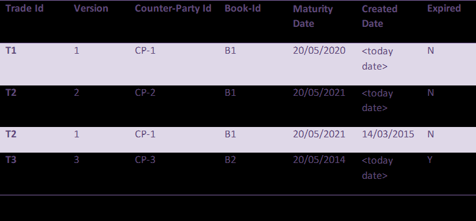

# Problem statement
There is a scenario where thousands of trades are flowing into one store, assume any way of transmission of trades. We need to create a one trade store, which stores the trade in the following order


There are couples of validation, we need to provide in the above assignment
1.	During transmission if the lower version is being received by the store it will reject the trade and throw an exception. If the version is same it will override the existing record.
2.	Store should not allow the trade which has less maturity date then today date.
3.	Store should automatically update the expire flag if in a store the trade crosses the maturity date.


# Getting Started
Spring boot application is created to implement the above scenario

#Assumption
1. Trades will flow by using rest API
2. Using H2 database to save the trades

##Pre-requisite
Below software are needed to install and run the application
- JDK 1.8+
- maven
- git

## Components
1. spring boot - framework to develop the application 
2. Rest API - Two rest apis are exposed
   1. POST /trade - will validate create/update the tade in H@ database
   2. GET /trade/{id} - wil return the trade by trade id if exist in tade db
3. Scheduler - will update the expired flag.  scheduler is scheduled to run at every 30 sec 
4. postman collection - postman collection is attached to execute the rest api
   1. Please import trade-store.postmen_collection.json from the project
5. Database - uses H2 in memory database
   1. use url http://localhost:8080/h2-ui to connect h2 database, after stating the application
   2. table will be created automatically by using property spring.jpa.hibernate.ddl-auto= update
6. Unit Test - 
   1. Total 17 unit test case written for this application
   2. One test case will take 1 min to run which will test the scheduler frequency. 
   3. If changing the scheduler the frequency then disable this test

## Installation
```
mvn clean install
```

## test
```
mvn test
```

## run
run the below command from project home location where pom file is present after mvn clean install is successfull
```
maven command -> mvn spring-boot:run
or
java command -> java -jar target/tradestore-0.0.1-SNAPSHOT.jar

```

